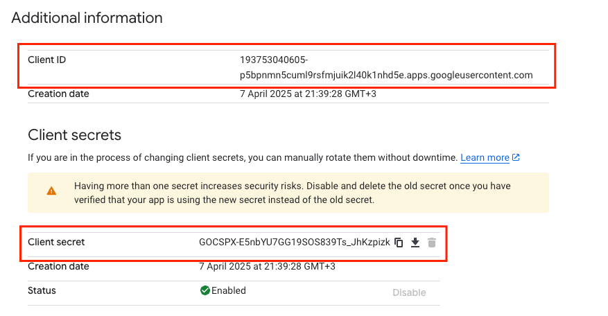
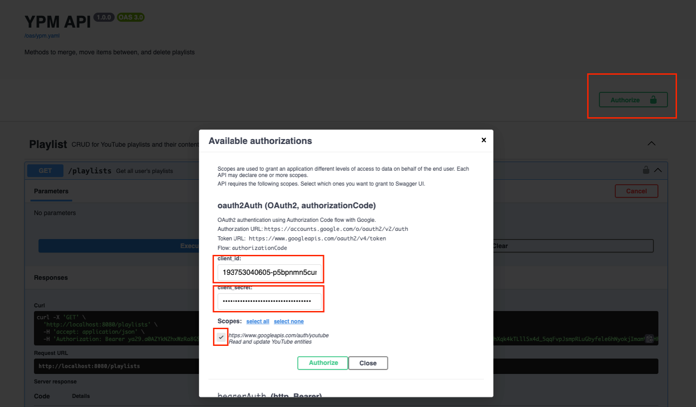

# YouTube Playlists Management API

<!-- TOC -->

* [YouTube Playlists Management API](#youtube-playlists-management-api)
    * [Description](#description)
    * [Main Features](#main-features)
        * [Merge, delete, move videos between playlists](#merge-delete-move-videos-between-playlists)
    * [Getting Started Locally](#getting-started-locally)
    * [Usage](#usage)
        * [Authorization](#authorization)
    * [Contributing](#contributing)
    * [License](#license)
    * [Contact](#contact)

<!-- TOC -->

## Description

The YouTube Playlists Management API is a tool designed to help us manage our YouTube
playlists more efficiently. It allows to perform bulk edits on playlists via rest
calls.

## Main Features

Merge, delete, move videos between playlists. We provide rest api for all of that. The problem that
we tried to solve originally was - organize videos from `Watch Later` to different playlists.
Unfortunately YT API doesn't provide access to the `Watch Later` playlist, so we have csv import
functionality. `Watch Later` contents can be exported via Google Takeout and then imported as a
manageable playlist to YPM.

## Getting Started Locally

We recommend pulling an image in case u want to start locally. Pull and start
`ghcr.io/leingenm/ypm:main`. The app is going to be available at `localhost:8080`.

## Usage

### Authorization

We require setting up ur own auth 2.0 app
in [Google Console](https://support.google.com/googleapi/answer/6158849?hl=en#zippy=).

1. Create a project and finish the basic configuration
2. Enable
   [
   `YouTube Data API v3`](https://console.cloud.google.com/apis/library/youtube.googleapis.com?invt=AbuI9A&project=amiable-raceway-456118-j4)
   for your project
3. Go to the `Data access` and add `https://www.googleapis.com/auth/youtube` > `Save`
4. Go to the `Audience` > Add your Google account to `Test users`
5. Go to `Credentials` > Click `Create credentials` > `OAuth client ID`
6. Select `Web application` in the `Application type` dropdown
7. We recommend adding the following to `Authorised JavaScript origins`

* `http://localhost`
* `https://ypmngr.xyz`

8. We recommend adding the following to `Authorised redirect URIs`

* `http://localhost:8080/swagger-ui/oauth2-redirect.html`
* `https://ypmngr.xyz/swagger-ui/oauth2-redirect.html`
* `https://oauth.pstmn.io/v1/callback`

Use ur OAuth 2.0 Client `client_id` and `client_secret` in our swagger (don't forget to
select the scope checkbox). First token exchange will require quite a few authorization screen
clicks which is connected with authorizing ur Google Console app to ur YT account data.

    
    

## Contributing

We welcome contributions from the community. Please read
our [Contributing Guide](https://github.com/leingenm/ypm/blob/main/.github/CONTRIBUTING.md) for
more information on how to contribute to our project.

## License

This project is licensed under the MIT License. See
the [LICENSE](https://github.com/leingenm/ypm/blob/main/LICENSE) file for details.

## Contact

If you have any questions or feedback, please feel free to contact us or create an issue or bug
request in [Issues](https://github.com/leingenm/ypm/issues/new/choose).
